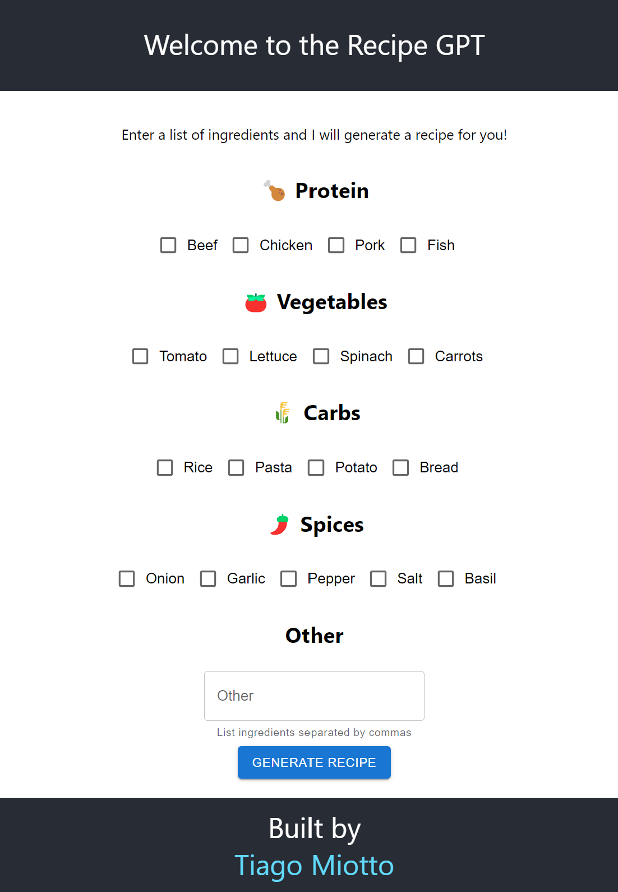

# Recipe Generator Website

Welcome to the Recipe Generator website! This project combines an Express.js backend with a React frontend and the Material UI to provide users with a seamless experience for generating recipes based on a list of ingredients. The integration of the GPT-3.5 API adds a touch of artificial intelligence to create unique and customized recipes.




## Table of Contents

- [Features](#features)
- [Installation](#installation)
- [Usage](#usage)
- [Configuration](#configuration)
- [API Integration](#api-integration)
- [Contributing](#contributing)
- [License](#license)

## Features

- **Ingredient-Based Recipe Generation:** Users can input a list of ingredients they have on hand, and the AI-powered GPT-3.5 model will generate a recipe suggestion that utilizes those ingredients.

- **Interactive User Interface:** The React frontend provides an intuitive and user-friendly interface for entering ingredients and receiving recipe ideas.

- **Express.js Backend:** The backend handles user requests, communicates with the GPT-3.5 API, and serves as the bridge between the frontend and the AI model.

- **Customization:** Users can specify preferences such as dietary restrictions, cuisine types, and more to tailor the generated recipes to their needs.

## Installation

Follow these steps to set up the Recipe Generator on your local machine:

1. Clone this repository to your local machine using:
   ```bash
   git clone https://github.com/tiagomiotto/recipe-gpt.git
   ```

2. Navigate to the project directory:
   ```bash
   cd recipe-generator
   ```

3. Install the dependencies for both the frontend and backend:
   ```bash
   cd client
   npm install
   cd ../api
   npm install
   ```

## Usage

1. Start the backend server:
   ```bash
   cd api
   npm start
   ```

2. In a separate terminal, start the frontend development server:
   ```bash
   cd client
   npm start
   ```

3. Open your web browser and navigate to `http://localhost:3000` to access the Recipe Generator website.

## Configuration

Before using the Recipe Generator, make sure to configure the GPT-3.5 API integration:

1. Create the `.env` file in the `api` directory.

2. Open the `.env` file and replace `OPENAI_API_KEY` with your actual GPT-3.5 API key.

3. Create the `.env` file in the `client` directory.

4. Open the `.env` file and replace `REACT_APP_API_ENDPOINT` with localhost and the port you are running your server


## API Integration

The Recipe Generator uses the GPT-3.5 API to generate recipes based on user input. The integration with the API is handled in the `api` using the `openai` library. Refer to the [official OpenAI documentation](https://beta.openai.com/docs/) for more information on using the GPT-3.5 API effectively.

## Contributing

We welcome contributions to improve the Recipe Generator project! To contribute, follow these steps:

1. Fork the repository to your GitHub account.

2. Clone your forked repository and make changes in your local branch.

3. Create a pull request describing your changes and improvements.

4. Your pull request will be reviewed, and upon approval, it will be merged into the main repository.

## License

This project is licensed under the [MIT License](LICENSE), which means you're free to use, modify, and distribute the code as you please.

---

Happy cooking and coding! If you have any questions or need assistance, feel free to [open an issue](https://github.com/your-username/recipe-generator/issues). Enjoy generating delicious recipes with AI!
